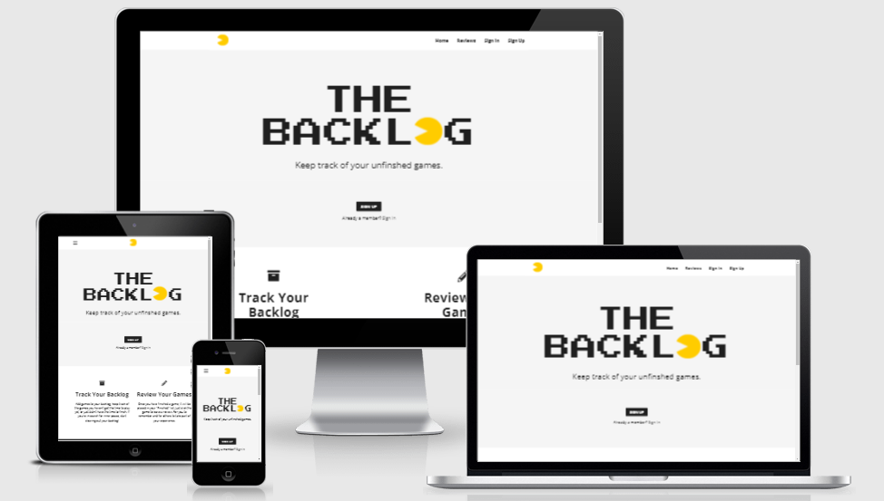

<h1 align="center">The Backlog</h1>

[View the live project here.](http://backlog-gamesite.herokuapp.com/)

On this site you will be able to keep track on your gaming, add the games you haven't played yet, or start reviewing the games you have played. Register an account and start adding to your own backlog. 

<h2 align="center"></h2>

## Table Of Content
1.[**UX**](#user-experience) 
- [**User Stories**](#user-stories)
- [**Strategy**](#strategy)
- [**Scope**](#scope)
- [**Structure**](#structure)
- [**Skeleton**](#skeleton)
    - [**Wireframes**](#wireframes)
- [**Surface**](#surface)
    - [**Design**](#design)

2.[**Features**](#features)
- [**Features For The Future**](#features-for-the-future)

3.[**Technologies**](#technologies-used)

4.[**Testing**](#testing)

5.[**Deployment**](#deployment)

6.[**Credits**](#credits)
- [**Code**](#code)
- [**Acknowledgements**](#acknowledgements)

---

## User Experience (UX)

-   ### User stories

    -   #### First Time Visitor Goals

        1. I would like to get a clear instructions on what the site is about, what I can do. 
        2. I would like to easily navigate my way through the site.  
        3. I want the registration process to be smooth and availible. 

    -   #### Frequent User Goals
        1. I would like the login process to be a button click away. 
        2. I want to add new games to my backlog easily, maybe add multiple games at once. 
        3. I want to review my finshed game, and let others see my reviews. 
        4. I would like to search for a specific game review, to see other users thought on that game.
        5. I would want to add pictures to my review.  
        6. I want to see other users backlog. 
        7. I would like to know where I could purchase a copy of a game.

---

- ### Strategy
    - This site focuses on the gamers, one of the larges growing community in the world. During this recent pandemic, lots of gaming companies has delayed there games. So there hasn't been to many new games released. So by shortage of something to play, I started my backlog. With just pen and paper. I looked at the games I missed or didn't have time to finish and started to write them down. So the reason for this website is for you to keep better track on your own perosnal backlog. Just add your games to your list. And when you are done, you can leave a short review of your experience, for other users to see.

---

- ### Scope
    
    - So the users of this site should be able to create an account, add to there own backlog, review there finished games & look on other users reviews and backlogs. More features will be to add a link to where you can buy the games. 

---

- ### Structure
- Navbar
    - At the top of the page I will have a navbar so you can easily navigate around the site. 
    - On smaller devices the navbar links will collapse into a toggler menu. With a button to reveal the links in a good looking [sidenav](static/img/img-readme/mobileSidenav.png).
- Home
    - At first you will see the page header, A short description on what the site is about, and then you can choose to Register an account or Log in. 
- Review Page
    - At the review page you will see other users reviews as well as our own, displaying from newest to oldest post. 
    - 
- My page
    - At this page you will store your backlog in a list. 
    - Also displayed in a list would be yor finished games.
    - Underneath those lists you can see your own reviews, in an order from newest to oldest.
    - When you are done with a game, review the game and it will be for everybody to see at this page. Viewing the newest to oldest reviews.
    - The reviews will be stored in mongoDB.
- Register
    - A easily understanable register page, centered in the middle of the page. Come up with a nickname, enter a password, and you are ready to start your backlog. 
- Log In
    - Will have the same estetics as the register page. 
    - Just enter your nickname and password and your are good to go. Will have simular styling as the register page. 
- Add to Backlog
    - Will have the same estetics as the register page.
    - At this page you will add games to your backlog.
    - You type in the name of your game, and it will be stores in your backlog.
    - The backlog will be stored in mongoDB.

---

- ### Skeleton
    *   ### Wireframes
    - Desktop
        - [Home Page](static/img/img-readme/home.png)
        - [My Page](static/img/img-readme/myPage.png)
        - [Reviews](static/img/img-readme/reviews.png)
        - [Register](static/img/img-readme/signUp.png)
    - Mobile
        - [Home](static/img/img-readme/mobileHome.png)
        - [Sidenav](static/img/img-readme/mobileSidenav.png)
        - [Register](static/img/img-readme/mobileSign.png)
        - [Review](static/img/img-readme/mobileReview.png)
        - [My page](static/img/img-readme/mobileMy.png)
        - [Log in](static/img/img-readme/mobileLog.png)
        - [Add](static/img/img-readme/mobileAdd.png)

---

- ### Surface

-   ### Design
    -   #### Colour Scheme
        -   The background color of the site, navbar and the about-section, the inside of the card at the backlog, finished backlog, sign up and sign in is set to a basic white color ([#ffffff](static/img/img-readme/ffffff.png)). 
        - Basically all the sections (except the footer and the about-section on the index page), has a light-grey ([#f0f0f0](static/img/img-readme/f0f0f0.png))  background color. 
        - The footer of the page has a dark grey ([#1f1f1f](static/img/img-readme/1f1f1f.png)) background color. 
        - My overall thoughts with this background color layout was that the color should gradually decrease in brightness, you start with the white, then the light grey, and at the footer is the dark grey. 
        - Where there is a white or lightgrey background color, the text color is set to the same dark grey color ([#1f1f1f](static/img/img-readme/1f1f1f.png)) as the footer. 
        - And at the footer the text is set to the same light-grey color ([#f0f0f0](static/img/img-readme/f0f0f0.png)) as in the most of the sections.
        - When you hover the anchor links at the page they ease in to a to a lilac color ([#850866](static/img/img-readme/850866.png)) with a underline. But at the footer the anchor links and social icons ease in to a yellow ([#ffcc00](static/img/img-readme/ffcc00.png)) color.  
        - The backlog has two icons after the game title, a "Check" icon and a "Delete" icon, when hovered the "Check" icon it eases in to a green ([#3e913e](static/img/img-readme/3e913e.png)) color. The "Delete" icon eases in to a red ([#b42020](static/img/img-readme/b42020.png)) color. 
        - The horizontal lines at the review page and the fullreview page has a slightly darker color then the light grey background. They have the color ([#7b7b6e](static/img/img-readme/7b7b6e.png)).
        In the reviews before you got to the fullreview page, has a text at the top wich just says "Reviews", that text is set to the same color as most of the anchor links, the lilac ([#850866](static/img/img-readme/850866.png)). But if hovered it get a slightly lighter lilac ([#b10e88](static/img/img-readme/b10e88.png))color 
        - The horizontal line just benath the header at the profile page is set to the color (black [#000000](static/img/img-readme/000000.png)) and fades out at the edges. 
        - The ["Back to the Top"](static/img/img-readme/additional01.png) button, has the same yellow ([#ffcc00](static/img/img-readme/ffcc00.png)) as the anchor links at the footer and the pacman images in the logo and at the navbar. But when hovered it get a slightly darker yellow ([#d8ad00](static/img/img-readme/d8ad00.png)) color. 
    -   #### Typography
        - The Fonts I've used for this site are from [Google Fonts](https://fonts.google.com/). The ones I've used are "Open Sans" and "Press Start 2P". 
            - ["Open Sans"](https://fonts.google.com/specimen/Open+Sans#about) is the main font for the page. I've choosed this font because it has a clean and readable look to it. Nice to have for informative text, and when you're typing.  
            - The font used for header across the page has the ["Press Start 2P"](https://fonts.google.com/specimen/Press+Start+2P?query=press+) font. When I first saw this font, my mind went immediately to games. So just by having this font as the main header of the page, you'll get a hint of what the site is about. 
    -   #### Imagery
        - For the navbrand, the site logo and the favicon I've used a image of [Pacman](static/img/pacman.png). Pacman is one of the most iconic game characters of all time, so I thought he would be perfect for this page, wich purpose is about games. For the site logo, I've put the image of pacman instead of the letter "O".
        - Images are also used in the reviews. The purpose for those images is to show something from the game you reviewed.

---

## Features

- Navbar
    - The [navbar](static/img/img-readme/navbar01.png) is set at the top of the page. On mobile veiw the the navbar collapses into a burger [menu](static/img/img-readme/navbar04.png), by clicking the menu, the menu choices will be displayed to the [left](static/img/img-readme/navbar05.png) of the screen.

- Home
    - Upon entering the site, first thing you'll see below the navbar is a [header-text](static/img/img-readme/index04.png), a short but informative [text](static/img/img-readme/index05.png) about the site and a choice to [sign up or sign in](static/img/img-readme/index06.png). All together looks like [this](static/img/img-readme/index01.png). 
    - When you are logged in as a user, the sign up button and the sign in links are [hidden](static/img/img-readme/index03.png). 
    - Below all of this I have an more explaining [section](static/img/img-readme/index02.png) on what you can do on this page.

     
- Reviews
    - At the top of the review page there is a [header-text](static/img/img-readme/reviews01.png) and an informative text. 
    - Below there is a [search](static/img/img-readme/reviews02.png) bar. You can search for review title, genre, developer & platform. 
    - Then there is the [reviews](static/img/img-readme/reviews03.png), by clicking on the [title](static/img/img-readme/reviews05.png) or the [image](static/img/img-readme/reviews06.png) for a review, you'll get to see the full review. Underneath the review title there is some minor information of the [platform, genre and developer](static/img/img-readme/reviews04.png). 
    Below that there is a capturing [text](static/img/img-readme/reviews07.png), just to get the reader atention. At the very bottom you can see wich [user](static/img/img-readme/reviews08.png) that made the review
    
- Full Review 
    - At the top of the page is the review [image](static/img/img-readme/fullreview01.png) followed by the [title](static/img/img-readme/fullreview02.png).
    - Just beneth the title is the [information](static/img/img-readme/fullreview03.png) of the platform you can play the game on, wich genre, who is the developer & the duration of the game.
    - Then there is the thoughts from the user displayed in [text](static/img/img-readme/fullreview04.png). 
    - Made a simple rating system where you rate the game from 1-5 where 1 is bad and 5 is awesome, and the games [rating](static/img/img-readme/fullreview05.png) is displayed just under the review text. 
    - And after that you can see wich [user](static/img/img-readme/fullreview06.png) who has done the review.
    - When you are done with the review, you can easily click the [link](static/img/img-readme/fullreview07.png) at the bottom to get back to the review page. 

- Profile 
    - When you are a newly registred member of the site, you'll can visit you profile page and start adding your games. At the top of the page is a [header-text](static/img/img-readme/profile01.png) where the users name is displayed. If you haven't added any games to you backlog or finished lists, or done any reviews yet. The page will look like [this](static/img/img-readme/profile02.png). 
    - When adding a game to your backlog, press the button wich says ["Add To Backlog"](static/img/img-readme/profile03.png). And you will end up at the [Add to Backlog](static/img/img-readme/profile09.png) page. Add one game at a time, when your done adding a game, click the "Add To Backlog" button, a [message](static/img/img-readme/profile10.png) is displayed saying the adding process was successful. Keep adding games or click the "Check your backlog" [link](static/img/img-readme/profile11.png) wich takes you back to your profile page. Your [backlog](static/img/img-readme/profile04.png) will appear with the game(s) you have added. 
    - If you click on a game [title](static/img/img-readme/profile05.png) in your backlog, you can [edit](static/img/img-readme/profile12.png) your game if you for example made a typo. When you are done editing press the edit button a [message](static/img/img-readme/profile12.png) is displayed saying that the editing process was successful. If You dont want to edit, click the cancel button an you will be sent back to your profile page. 
    - By clicking on the ["X"](static/img/img-readme/profile06.png) icon to the right of your games, you delete that game. 
    - When you click on the ["check"](static/img/img-readme/profile07.png) icon, it means that you have finshed that game, and the game gets sent over to the [finshed](static/img/img-readme/profile08.png) list. 
    - By clicking a game title in the finshed list, you can make a [review](static/img/img-readme/profile14.png) of that game. The Review title is set to the game [title](static/img/img-readme/profile15.png), then you have some fields to fill. First up is the [capturing text](static/img/img-readme/profile16.png), maximum of 50 characters. Then you can choose between abunch of [genres](static/img/img-readme/profile17.png) from a dropdown list. Next up choose what [platform](static/img/img-readme/profile18.png) you can play the game on. More the one platform? Choose "Multiplatform". Then the [developer](static/img/img-readme/profile19.png) field, [duration](static/img/img-readme/profile20.png) field. After all this it's time to put your thoughts of the game into words at the [review](static/img/img-readme/profile21.png) field. Made a basic [rating](static/img/img-readme/profile22.png) system, you choose between 1-5 in a dropdown menu, where 1 is bad and 5 is awesome. 
    To make your review complete, you can add a [images](static/img/img-readme/profile23.png) to it. 
    Then click the ["Add Review"](static/img/img-readme/profile24.png) button, and the review is done.
    Not happy with the review for some reason, or just not in the mood, click the ["Cancel"](static/img/img-readme/profile25.png) button, and your back at your profile page in no time.
  
- Sign Up
    - This is were you can [sign up](static/img/img-readme/signUp01.png) for this page, figure out a username, if you have choosed the same username as an already existing user possesses, a [message](static/img/img-readme/signUp02.png) explains the situation, and you have to come up with a new username. 
    - When you have an unique username, and have entered your password of choice. You'll be redirected to your own profile page, at the profile page there is a [message](static/img/img-readme/signUp03.png) at the top wich tells you that the registration was a success.
  
- Sign In
    - When you return to the website, as a already registred user, just sign in at the [sign in](static/img/img-readme/signIn01.png) page. If you spell either your username or password wrong, a [message](static/img/img-readme/signIn02.png) appears at the top of the page.
    

- Footer
    - The footer looks the same across all the pages. You can send me an mail just by clicking the [Email](static/img/img-readme/footer01.png) under the "Get In Touch" header. Under the header "Social Media" you can visit my github, linkedIn or Instagram by clicking any of the [icons](static/img/img-readme/footer02.png). 

- Additional Features
    - When scrolling down on any of the pages a Back to the Top [button](static/img/img-readme/additional01.png) appears in the bottom right corner of the screen. Click it if you think you have scrolled down to far, and you get back to the top of the page. 

### Features for the future 

- I would like to add backlog opportunities for movies, and TV Series, wich you also could review when your done watching. 
- A more complex rating system. For example gather up all the ratings for one game, and combine the score to make an overall rating of that game.
- A top list for the games with the highest/lowest rating score. 
- Connect the site to a video game database, such as [RAWG](https://rawg.io/).


---

## Technologies Used

### Languages Used

-   [HTML5](https://en.wikipedia.org/wiki/HTML5)
-   [CSS3](https://en.wikipedia.org/wiki/Cascading_Style_Sheets)
-   [JavaScript](https://www.javascript.com/)
-   [Python](https://www.python.org/)

### Frameworks, Libraries & Programs Used

- [jQuery](https://jquery.com/) - Used for materialize compontents.

- [Flask](https://flask.palletsprojects.com/en/1.1.x/) - The project uses Flask, which is a Python microframework. 

- [PyMongo](https://pypi.org/project/pymongo/) - The project uses PyMongo as the Python API for MongoDB. To link the backend data to frontend application. 

- [Materialize](https://materializecss.com/) - The project uses the Materialize framework for structure of the website.

- [MongoDB]() - The project uses MongoDB to store the database in the cloud.

- [Jinja](https://jinja.palletsprojects.com/en/3.0.x/) - Jinja was used with flask in the HTML code. For simple linking between the backend and frontend. 

- [Heroku]() - Heroku was used as the hosting platform to deploy my project.

- [Werkzeug](https://werkzeug.palletsprojects.com/en/2.0.x/) - Used to generate password hash. 

- [FontAwesome](https://fontawesome.com/) - provides icons across the site

- [GoogleFonts](https://fonts.google.com/) - Main font and header font for this site. 

- [Git](https://git-scm.com/) - Git was used for version control.

- [GitHub](https://github.com/) - GitHub was used to store the project.

- [Balsamiq](https://balsamiq.com/) - Balsamiq was used to create the wireframes.

- [Am I Responsive](http://ami.responsivedesign.is/#) - Tested responsivness & the images at the top of the readMe.

- [Color Hex](https://www.color-hex.com/) - The color images wich are displayed at the [**Design**](#design) section of this readMe.

- [Amp What](https://www.amp-what.com/) - At the footer, and sidenav.  

## Testing

---

-   [W3C Markup Validator](https://validator.w3.org/nu/?doc=http%3A%2F%2Fbacklog-gamesite.herokuapp.com%2F)
-   [W3C CSS Validator](https://jigsaw.w3.org/css-validator/#validate_by_input) 
    -   [No Error Found](static/img/img-readme/cssValidation.png)
    -   [Warning](static/img/img-readme/cssWarning.png)
### Lighthouse Testing

--- 

1.  [index.html](pdf/index.pdf)
2.  [reviews.html](pdf/review.pdf)
3.  [login.html](pdf/signIn.pdf)
4.  [register.html](pdf/signUp.pdf)
5.  [profile.html](pdf/profile.pdf) 
6.  [add_backlog.html](pdf/add_backlog.pdf)
7.  [edit_backlog.html](pdf/edit_backlog.pdf)
8.  [add_finished.html](pdf/add_finished.pdf)
9.  [add_review.html](pdf/add_review.pdf)
10. [edit_review.html](pdf/edit_review.pdf)
11. [full_review.html](pdf/full_review.pdf)


### Testing User Stories from User Experience (UX) Section

-   #### First Time Visitor Goals

-   #### Returning Visitor Goals

-   #### Frequent User Goals


### Further Testing

### Known Bugs

- So the first bug i've encounterd was when opening the sidenav on mobile view, at the users profile page. The pacman image looked like [this](static/img/img-readme/bug01.png). Only the alt text is showing. Now in late develepment I also used the pacman images as the navbrand and encountered the same problem, the navbrand image and the sidenav images dosen't show at the profile page, fullreview page, when you edit your backlog or when your about to write a review or edit your review. The difference between these pages are that these pages has an argument passed through the URL. The profile page has username, edit-backlog has backlog_id, fullreview has review_id and edit-review also has review_id passed through as an argumenet. By changing the src to the images address from my cloudninary instead of the img folder in my static files. The problem was no more.  

- Another bug I've encountered is at the edit-review page, I've preloaded the image field with it's current [value](static/img/img-readme/bug03.png), but if I don't load the same or a new images I get an error. ["Missing required parameter - file"](static/img/img-readme/bug02.png).


### Resolved Bugs

- When [deleting](static/img/img-readme/bug05.png) an object from your backlog, the one that is at the top of the list gets [deleted](static/img/img-readme/bug05.png), not the one that I've choosed. The problem came once I've added a modal wich just checks if you really want to delete the current object. If I remove the modal, then it's back to normal, the choosen object gets deleted. Went to slack, figured that somebody have had this problem before, and yes. So it basically generates a modal for every item in the loop.
Becouse I didn't give each modal and a link instance a unique id, it just always triggers one and the same modal the first modal in the loop, so thats why the top object always got deleted. So by adding [{{loop.index}}](static/img/img-readme/bugResolved01.png) to the modal ID both in the a link and modal. Each object in the backlog got it'
s own unique ID.

## Deployment

### Forking the GitHub Repository

By forking the GitHub Repository we make a copy of the original repository on our GitHub account to view and/or make changes without affecting the original repository by using the following steps...

1. Log in to GitHub and locate the [GitHub Repository](https://github.com/)
2. At the top of the Repository (not top of page) just above the "Settings" Button on the menu, locate the "Fork" Button.
3. You should now have a copy of the original repository in your GitHub account.

### Making a Local Clone

1. Log in to GitHub and locate the [GitHub Repository](https://github.com/)
2. Under the repository name, click "Clone or download".
3. To clone the repository using HTTPS, under "Clone with HTTPS", copy the link.
4. Open Git Bash
5. Change the current working directory to the location where you want the cloned directory to be made.
6. Type `git clone`, and then paste the URL you copied in Step 3.

```
$ git clone https://github.com/YOUR-USERNAME/YOUR-REPOSITORY
```

7. Press Enter. Your local clone will be created.

```
$ git clone https://github.com/YOUR-USERNAME/YOUR-REPOSITORY
> Cloning into `CI-Clone`...
> remote: Counting objects: 10, done.
> remote: Compressing objects: 100% (8/8), done.
> remove: Total 10 (delta 1), reused 10 (delta 1)
> Unpacking objects: 100% (10/10), done.
```

Click [Here](https://help.github.com/en/github/creating-cloning-and-archiving-repositories/cloning-a-repository#cloning-a-repository-to-github-desktop) to retrieve pictures for some of the buttons and more detailed explanations of the above process.

## Credits

### Code

### Content

### Media

### Acknowledgements
